# Muratcan Koylan on X: "The File System Is the New Database: How I Built a Personal OS for AI Agents" / X
[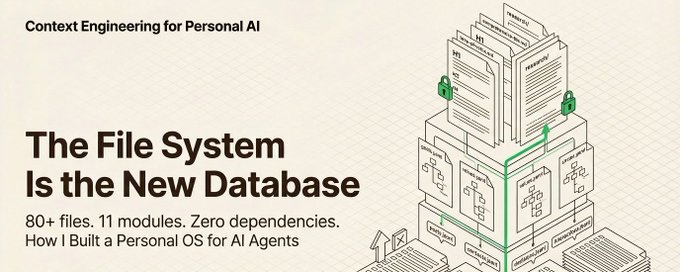](/koylanai/article/2025286163641118915/media/2025270258316005376)
The File System Is the New Database: How I Built a Personal OS for AI Agents
Every AI conversation starts the same way. You explain who you are. You explain what you're working on. You paste in your style guide. You re-describe your goals. You give the same context you gave yesterday, and the day before, and the day before that. Then, 40 minutes in, the model forgets your voice and starts writing like a press release.
I got tired of this. So I built a system to fix it.
I call it Personal Brain OS. It's a file-based personal operating system that lives inside a Git repository. Clone it, open it in Cursor or Claude Code, and the AI assistant has everything: my voice, my brand, my goals, my contacts, my content pipeline, my research, my failures. No database, no API keys, no build step. Just 80+ files in markdown, YAML, and JSONL that both humans and language models read natively.
Muratcan Koylan
@koylanai
·
[Dec 30, 2025](/koylanai/status/2005827257458131321)
Context Engineering Skills 10x'd my project creation.
I rebuilt my digital brain system with Claude Code using the Context Plugin, so it is now a Personal OS.
It provides a complete folder-based architecture for managing:
- Personal Brand - Voice, positioning, values
- Content Creation - Ideas, drafts, publishing pipeline
- Knowledge Base - Bookmarks, research, learning
- Network - Contacts, relationships, introductions
- Operations - Goals, tasks, meetings, metrics
Because we're using Context Engineering principles in the Skills & Agent [.]md files, the system can be easily managed by small agents.
I'm adding the entire repo to GitHub tonight 🤫
[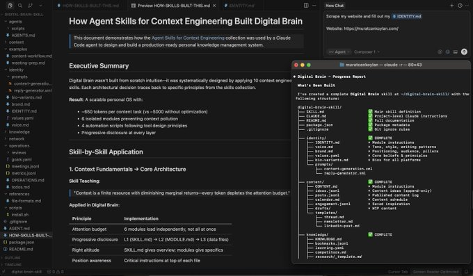](/koylanai/status/2005827257458131321/photo/1)
Quote
Muratcan Koylan
@koylanai
·
Oct 6, 2025
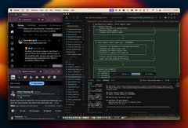
7:31
How I built an AI agent system that automatically maintains my digital brain based on the content I engage with?
My personal context engineering architecture with Claude Sonnet 4.5, Groq Compound, Browser Use, all in Cursor 👇
I'm sharing the full architecture, the design decisions, and the mistakes so you can build your own version. Not a copy of mine; yours. The specific modules, the file schemas, the skill definitions will look different for your work. But the patterns transfer. The principles for structuring information for AI agents are universal. Take what fits, ignore what doesn't, and ship something that makes your AI actually useful instead of generically helpful.
Here's how I built it, why the architecture decisions matter, and what I learned the hard way.
## 1) THE CORE PROBLEM: CONTEXT, NOT PROMPTS
Most people think the bottleneck with AI assistants is prompting. Write a better prompt, get a better answer. That's true for single interactions and production agent prompts. It falls apart when you want an AI to operate as you across dozens of tasks over weeks and months.
The Attention Budget: Language models have a finite context window, and not all of it is created equal. This means dumping everything you know into a system prompt isn't just wasteful, it actively degrades performance. Every token you add competes for the model's attention.
[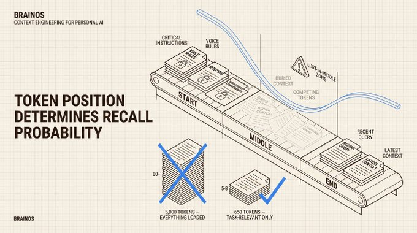](/koylanai/article/2025286163641118915/media/2025256255552356352)
Our brains work similarly. When someone briefs you for 15 minutes before a meeting, you remember the first thing they said and the last thing they said. The middle blurs. Language models have the same U-shaped attention curve, except theirs is mathematically measurable. Token position affects recall probability. The newer models are getting better at this, but still, you are distracting the model from focusing on what matters most. Knowing this changes how you design information architecture for AI systems.
Muratcan Koylan
@koylanai
·
[Dec 12, 2025](/koylanai/status/1999192104850133146)
AI Agent Personas should simulate the structure of human reasoning.
I’ve been arguing that you cannot "invent" a digital expert agent using just prompt engineering. You have to extract the expert via deep interviewing.
A new NeurIPS paper, "Simulating Society Requires
Show more
[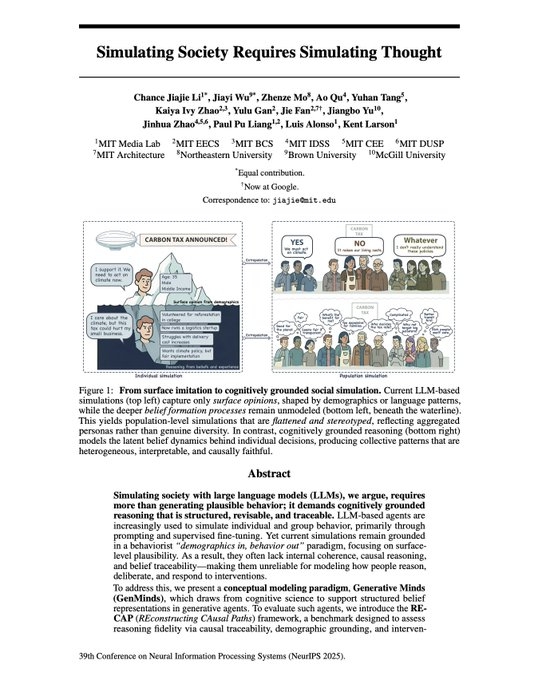](/koylanai/status/1999192104850133146/photo/1)
Quote
Muratcan Koylan
@koylanai
·
Dec 10, 2025
[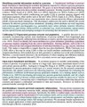](/koylanai/status/1998530190847390025/photo/1)
You should NOT use LLMs to generate synthetic human-like profiles.
I just read the NeurIPS paper "LLM Generated Persona is a Promise with a Catch" and it confirms a suspicion we’ve held for a long time: You cannot "invent" a realistic human being using just statistics and an
Instead of writing one massive system prompt, I split Personal OS into 11 isolated modules. When I ask the AI to write a blog post, it loads my voice guide and brand files. When I ask it to prepare for a meeting, it loads my contact database and interaction history. The model never sees network data during a content task, and never sees content templates during a meeting prep task.
Muratcan Koylan
@koylanai
·
[Dec 10, 2025](/koylanai/status/1998530190847390025)
You should NOT use LLMs to generate synthetic human-like profiles.
I just read the NeurIPS paper "LLM Generated Persona is a Promise with a Catch" and it confirms a suspicion we’ve held for a long time: You cannot "invent" a realistic human being using just statistics and an LLM.
Yes, they are more scalable and cost-effective alternative to human interviews to create digital expert personas but this paper also proves that these synthetic profiles contain systematic biases that skew simulation results away from real-world outcomes.
The more creative freedom you give an LLM to generate a persona’s backstory, the further it drifts from reality.
Another important finding is that as LLM-generated content increases, simulated personas shift progressively toward left-leaning stances.
LLMs also systematically generate personas with overly optimistic outlooks, using positively valenced terms like "love," "proud," and "community" while omitting life challenges or negative experiences. This emotional bias is horrible for strategy and creativity-related decision-making tasks!
If you are building AI agents for strategy or decision-making, you don't want an idealized "Yes Man."
This is why I keep posting about the importance of Tacit Knowledge, Context Engineering, and AI Interviewer to extract human knowledge.
The research paper critiques the practice of "inventing" people from statistical margins (Census data + LLM imagination), whereas the system should focus on "extracting" people from ground truth (Real Expert + Interview).
After testing and evaluating LLM personas generated by public datasets, we observed that they are not ready for production AI agents.
That's why my focus is on building an interviewer experience that extracts as much learning as possible from the human expert, and creating a context system that grounds that expert's outputs in truth; using a real-time, long-form interview to capture "implicit knowledge" and "distinctive methodologies".
Another architectural difference that I find is relying heavily on single-pass prompting. They feed demographic data into an LLM and ask it to generate a "Descriptive Persona" (a narrative bio). They found this introduces massive bias.
To address these critical flaws in the current persona generation, I propose the following to resolve or at least mitigate these specific issues:
1. Addressing the "Joint Distribution" Issue:
Researchers report that they cannot precisely simulate an individual due to fragmented datasets (e.g., they have data on "Income" and "Education" separately but lack information on their overlap for a specific person), resulting in "incongruous combinations."
By interviewing a real human, you capture the natural joint distribution of their beliefs. You don't have to guess if a "high-income expert" cares about "sustainability"; the expert tells you. We need to bypass the statistical reconstruction problem entirely by building scalable interviewer solutions.
2. Avoiding "Positivity Bias" & "Leftward Drift": The paper proves that when LLMs are asked to write a persona description (Descriptive Persona), they default to "pollyannaish," overly positive, and politically progressive profiles.
The interviewer system should be designed to gather insights into "mistakes," "judgment," and "distinctive methodologies" rather than generic best practices. By forcing the model to ingest a transcript of hard-won lessons and failures, you will override the model's default tendency to be "nice" and "generic."
The paper also mentions a lack of "ground truth" to validate if a persona is accurate. My solution includes a built-in validation loop where the human expert reviews and scores the output. This "Human-in-the-Loop" verification is exactly what the researchers argue is missing from the field.
"Descriptive Personas" generated by LLMs are articulate but statistically flawed. To scale true expertise, we must stop trying to simulate people and start interviewing them.
[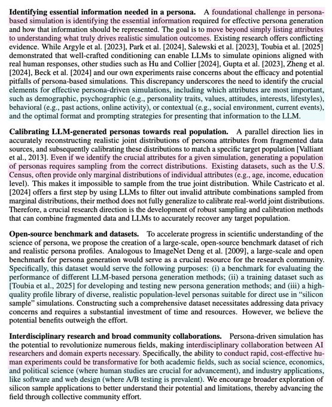](/koylanai/status/1998530190847390025/photo/1)
Progressive Disclosure: This is the architectural pattern that makes the whole system work. Instead of loading all 80+ files at once, the system uses three levels. Level 1 is a lightweight routing file that's always loaded. It tells the AI which module is relevant. Level 2 is module-specific instructions that load only when that module is needed. Level 3 is the actual data JSONL logs, YAML configs, research documents, loaded only when the task requires them.
This mirrors how experts operate. The three levels create a funnel: broad routing, then module context, then specific data. At each step, the model has exactly what it needs and nothing more.
[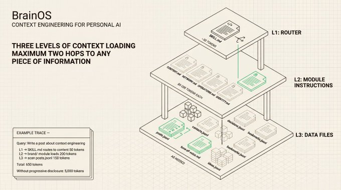](/koylanai/article/2025286163641118915/media/2025256717408223233)
My routing file is `
[SKILL.md](//SKILL.md)
` that tells the agent "this is a content task, load the brand module" or "this is a network task, load the contacts." The module instruction files (`
[CONTENT.md](//CONTENT.md)
`, `
[OPERATIONS.md](//OPERATIONS.md)
`, `
[NETWORK.md](//NETWORK.md)
`) are 40-100 lines each, with file inventories, workflow sequences, and an `<instructions>` block with behavioural rules for that domain. Data files load last, only when needed. The AI reads contacts line by line from JSONL rather than parsing the entire file. Three levels, with a maximum of two hops to any piece of information.
Muratcan Koylan
@koylanai
·
[Dec 7, 2025](/koylanai/status/1997444237890081104)
Most people treat AI like Google: ask a question, get an answer. But what if AI could think \*like/with you?\*
I reverse-engineer "Theory of Mind" to test if the model can form a "theory of my mind".
Using AI as a mirror to understand myself by giving it personal context and
Show more

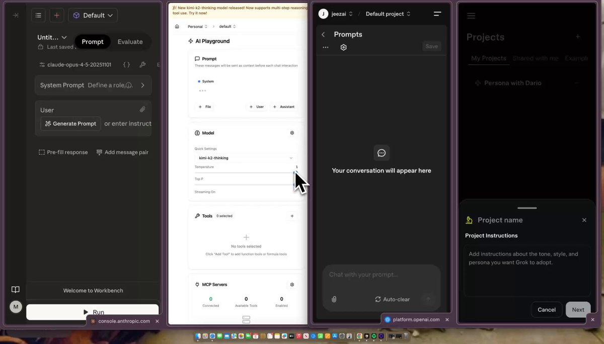
Quote
Carlos E. Perez
@IntuitMachine
·
Dec 6, 2025
[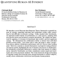](/IntuitMachine/status/1997131059805163542/photo/1)
You know how some people seem to have a magic touch with LLMs? They get incredible, nuanced results while everyone else gets generic junk.
The common wisdom is that this is a technical skill. A list of secret hacks, keywords, and formulas you have to learn.
But a new paper
The Agent Instruction Hierarchy: I built three layers of instructions that scope how the AI behaves at different levels. At the repository level, `
[CLAUDE.md](//CLAUDE.md)
` is the onboarding document -- every AI tool reads it first and gets the full map of the project. At the brain level, `
[AGENT.md](//AGENT.md)
` contains seven core rules and a decision table that maps common requests to exact action sequences. At the module level, each directory has its own instruction file with domain-specific behavioral constraints.
[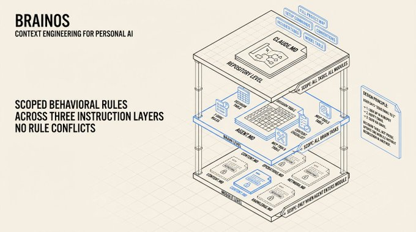](/koylanai/article/2025286163641118915/media/2025266558931525632)
This solves the "conflicting instructions" problem that plagues large AI projects. When everything lives in one system prompt, rules contradict each other. A content creation instruction might conflict with a networking instruction. By scoping rules to their domain, you eliminate conflicts and give the agent clear, non-overlapping guidance. The hierarchy also means you can update one module's rules without risking regression in another module's behavior.
[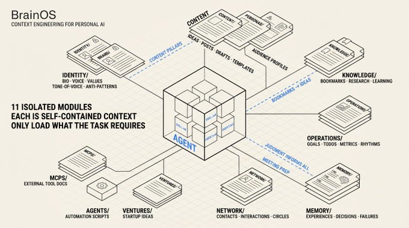](/koylanai/article/2025286163641118915/media/2025257778005069824)
My `
[AGENT.md](//AGENT.md)
` is a decision table. The AI reads "User says 'send email to Z'" and immediately sees:
1. Step 1, look up contact in HubSpot.
2. Step 2, verify email address.
3. Step 3, send via Gmail.
Module-level files like `
[OPERATIONS.md](//OPERATIONS.md)
` define priority levels (P0: do today, P1: this week, P2: this month, P3: backlog) so the agent triages tasks consistently. The agent follows the same priority system I use because the system is codified, not implied.
## 2) THE FILE SYSTEM AS MEMORY
One of the most counterintuitive decisions I made: no database. No vector store. No retrieval system except Cursor or Claude Code's features. Just files on disk, versioned with Git.
[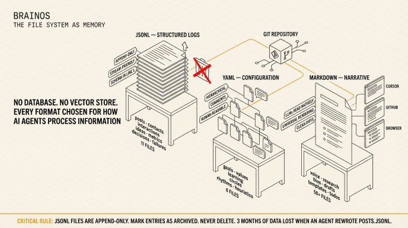](/koylanai/article/2025286163641118915/media/2025258736168660992)
Format-Function Mapping: Every file format in the system was chosen for a specific reason related to how AI agents process information. JSONL for logs because it's append-only by design, stream-friendly (the agent reads line by line without parsing the entire file), and every line is self-contained valid JSON. YAML for configuration because it handles hierarchical data cleanly, supports comments, and is readable by both humans and machines without the noise of JSON brackets. Markdown for narrative because LLMs read it natively, it renders everywhere, and it produces clean diffs in Git.
Muratcan Koylan
@koylanai
·
[Feb 16](/koylanai/status/2023405681080938932)
The problem is how memory gets into the context window and what happens when compaction wipes it.
OpenClaw loads MEMORY[.]md plus the last two days of daily logs at session start. Static injection. Everything gets stuffed into the context window upfront. When the window fills up, compaction fires and summarizes your loaded memories away. The agent silently writes durable memories to disk before compaction hits. But after the window resets, the agent can't systematically browse what it flushed. It runs search queries and hopes the right chunks surface. The memory exists on disk. The agent just lost the ability to walk through it.
This is a context delivery problem.
Everything is a file. Mount memory, tools, knowledge, and human input into a single namespace. Give the agent list, read, write, and search operations. Let it pull what's relevant per turn instead of dumping everything at boot.
Cursor validated this in production with their "dynamic context discovery" approach, which stores tool responses, chat history, MCP tools, and terminal sessions as files that the agent reads on demand. When compaction fires in Cursor, the agent still has the full chat history as a file. It reads back what it needs instead of losing it to summarization.
Markdown memory files exist in OpenClaw. SQLite-backed hybrid search exists. memory\_search and memory\_get tooling exists. What's missing is the abstraction layer that turns static file loading into dynamic file system access.
Here's what that actually means in practice.
All agent context goes under one predictable namespace. Immutable interaction logs at /context/history/ are the source-of-truth timeline, spanning agents and sessions. Episodic memory at /context/memory/episodic/ holds session-bounded summaries. Fact memory at /context/memory/fact/ stores atomic durable entries like preferences, decisions, and constraints that rarely change. User memory at /context/memory/user/ tracks personal attributes. Task-scoped scratchpads at /context/pad/ are temporary working notes that can be promoted to durable memory or discarded. Tool metadata lives at /context/tools/. Session artifacts at /context/sessions/.
This three-tier split (scratchpad, episodic, fact) replaces OpenClaw's current binary between "today's log" and "forever file." MEMORY[.]md conflates atomic facts like "user prefers dark mode" with episodic context like what happened in last week's project. Daily logs conflate scratchpad work with session notes. Separating them gives each tier its own retention policy and promotion path.
The agent gets explicit file operations at runtime. It can discover what context is available before loading anything. It can pull only the exact slice needed. It can grep by keywords, semantics, or both. It can persist new memory with retention rules and promote validated context from temporary to durable storage. Memory stops being a preload and becomes something the agent discovers, fetches, and evolves per turn.
Between the filesystem and the token window, you need an operational layer. Before each reasoning turn, a constructor selects and compresses context from the filesystem into a token-budget-aware input.
It queries recency and relevance metadata, applies summarization, and produces a manifest recording what was selected, what was excluded, and why.
When memory fails silently, there's no way to ask "what did the agent load and what did it skip?" During extended sessions, an updater incrementally streams additional context as reasoning unfolds, replacing outdated pieces based on model feedback instead of stuffing everything upfront.
After each response, an evaluator checks outputs against source context, writes verified information back to the filesystem as structured memory, and flags human review when confidence is low.
Here's why this changes memory behavior.
Compaction stops being destructive. After the window resets, the agent can still list and read context files directly. Search-based retrieval still works, but now it's paired with structured browsing.
Token usage becomes demand-driven. The agent loads only what the active task requires.
Memory gets a real lifecycle. Scratchpad notes graduate to episodic summaries. Episodic summaries harden into durable facts. Each transition is a logged, versioned event with timestamps and lineage. No more binary split between "today's log" and "forever file."
Human review becomes native. Not just "you can open the Markdown file and check." Every mutation is a traceable event. Humans can diff memory evolution, audit what was promoted and why, and inject corrections that the agent discovers alongside its own memories.
Context assembly becomes debuggable. The manifest records what the constructor selected for each turn. When the agent gets something wrong, you can trace whether it had the right context, loaded the wrong slice, or never found the relevant file.
If you're hitting the same problem, here's the upgrade path that doesn't break existing workflows.
Start by returning file references before snippets and emitting manifests that log what was loaded per turn.
Then expose context sources under /context/\* paths and enable list and read at runtime so the agent can browse what's available without loading everything.
After that, shift boot-time injection to minimal preload plus on-demand fetch and decompose MEMORY[.]md into fact and episodic stores with separate retrieval.
The final step adds promotion, archival, retention policies, and audit logs so every state transition is versioned and reversible.
Your system needs to let the agent access context on demand instead of blindly inheriting it at startup.
[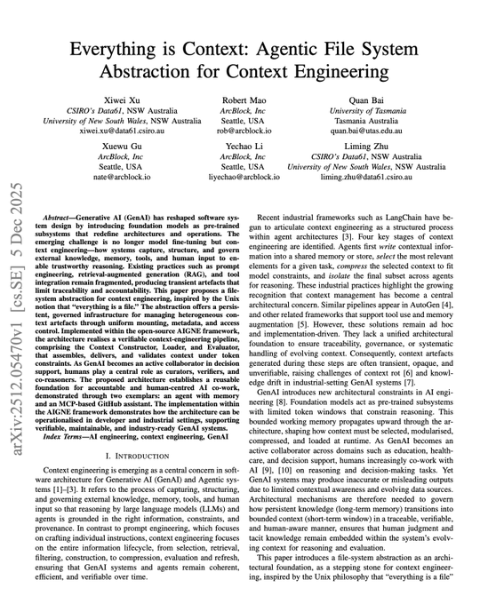](/koylanai/status/2023405681080938932/photo/1)
Quote
@levelsio
@levelsio
·
Feb 16
How did you guys fix persistent memory with OpenClaw? My bot keeps forgetting stuff, I already have qmd installed
JSONL's append-only nature prevents a category of bugs where an agent accidentally overwrites historical data. I've seen this happen with JSON files agent writes the whole file, loses three months of contact history. With JSONL, the agent can only add lines. Deletion is done by marking entries as `"status": "archived"`, which preserves the full history for pattern analysis. YAML's comment support means I can annotate my goals file with context the agent reads but that doesn't pollute the data structure. And Markdown's universal rendering means my voice guide looks the same in Cursor, on GitHub, and in any browser.
Muratcan Koylan
@koylanai
·
[Dec 5, 2025](/koylanai/status/1996905189656211931)
OpenAI wants markdown structure. Anthropic prefers XML tags. Google emphasizes few-shot examples.
So I built a simple agent system that reads the official prompting docs and applies them to the given prompt.
Each optimizer runs a ReAct loop:
- list\_provider\_docs → discover
Show more

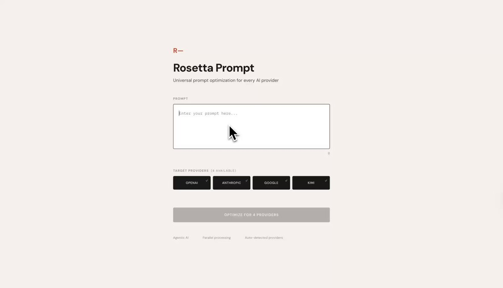
My system uses 11 JSONL files (posts, contacts, interactions, bookmarks, ideas, metrics, experiences, decisions, failures, engagement, meetings), 6 YAML files (goals, values, learning, circles, rhythms, heuristics), and 50+ Markdown files (voice guides, research, templates, drafts, todos). Every JSONL file starts with a schema line: `{"\_schema": "contact", "\_version": "1.0", "\_description": "..."}`. The agent always knows the structure before reading the data.
Muratcan Koylan
@koylanai
·
[Dec 5, 2025](/koylanai/status/1996757974610559171)
Your best people can't document their expertise because they don't know what they know until they're asked.
We built an interviewer that achieves peer status, so experts reveal the judgment patterns they'd only share with a colleague.
I wrote a blog about how we architected the multi-agent system behind this, how we extract expert thinking, and build digital personas that feel like talking to a peer.
[https://99ravens.agency/resources/blogs/your-experts-wont-train-your-ai-you-have-to-interview-them/…](https://t.co/83D7EBu9rw)
[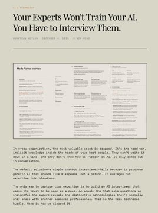](/koylanai/status/1996757974610559171/photo/1)
[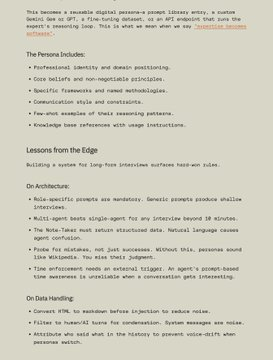](/koylanai/status/1996757974610559171/photo/2)
Quote
Anthropic
@AnthropicAI
·
Dec 5, 2025
We’re launching Anthropic Interviewer, a new tool to help us understand people’s perspectives on AI.
It’s now available at http://claude.ai/interviewer for a week-long pilot.
Episodic Memory: Most "second brain" systems store facts. Mine stores judgment as well. The `memory/` module contains three append-only logs: `experiences.jsonl` (key moments with emotional weight scores from 1-10), `decisions.jsonl` (key decisions with reasoning, alternatives considered, and outcomes tracked), and `failures.jsonl` (what went wrong, root cause, and prevention steps).
[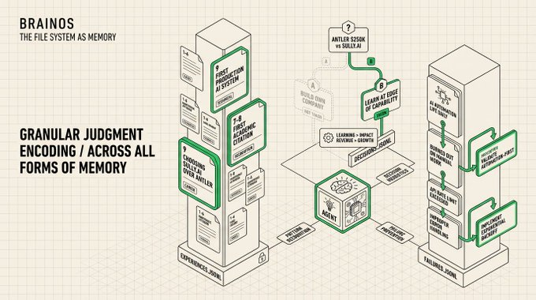](/koylanai/article/2025286163641118915/media/2025259682101702657)
There's a difference between an AI that has your files and an AI that has your judgment. Facts tell the agent what happened. Episodic memory tells the agent what mattered, what I'd do differently, and how I think about tradeoffs. When the agent encounters a decision similar to one I've logged, it can reference my past reasoning instead of generating generic advice. The failures log is the most valuable, it encodes pattern recognition that took real pain to acquire.
> When I was deciding whether to accept Antler Canada's $250K investment or join 
>
> [Sully.ai](//Sully.ai)
>
>  as Context Engineer, the decision log captured both options, the reasoning for each, and the outcome. If a similar career tradeoff comes up, the agent doesn't give me generic career advice. It references how I actually think about these decisions: "Learning > Impact > Revenue > Growth" is my priority order, and "Can I touch everything? Will I learn at the edge of my capability? Do I respect the founders?" is my company-joining framework.
Cross-Module References: The system uses a flat-file relational model. No database, but structured enough for agents to join data across files. `contact\_id` in `interactions.jsonl` points to entries in `contacts.jsonl`. `pillar` in `ideas.jsonl` maps to content pillars defined in `identity/brand.md`. Bookmarks feed content ideas. Post metrics feed weekly reviews. The modules are isolated for loading, but connected for reasoning.
Isolation without connection is just a pile of folders. The cross-references let the agent traverse the knowledge graph when needed. "Prepare for my meeting with Sarah" triggers a lookup chain: find Sarah in contacts, pull her interactions, check pending todos involving her, compile a brief. The agent follows the references across modules without loading the entire system.
My pre-meeting workflow chains three files: `contacts.jsonl` (who they are), `interactions.jsonl` (filtered by contact\_id for history), and `
[todos.md](//todos.md)
` (any pending items). The agent produces a one-page brief with relationship context, last conversation summary, and open follow-ups. No manual assembly. The data structure makes the workflow possible.
## 3) THE SKILL SYSTEM: TEACHING AI HOW TO DO YOUR WORK
Files store knowledge. Skills encode process. I built Agent Skills following the Anthropic Agent Skills standard, structured instructions that tell the AI how to perform specific tasks with quality gates baked in.
Muratcan Koylan
@koylanai
·
[Dec 28, 2025](/koylanai/status/2005082048973905938)
Most "agentic" failures happen because the model lacks specific domain knowledge.
Here I'm showing how loading a Skills Plugin solves that for dataset generation. I turned a research paper (shows fine-tuning dataset creation from books) into a Skill and just gave a book link
Show more

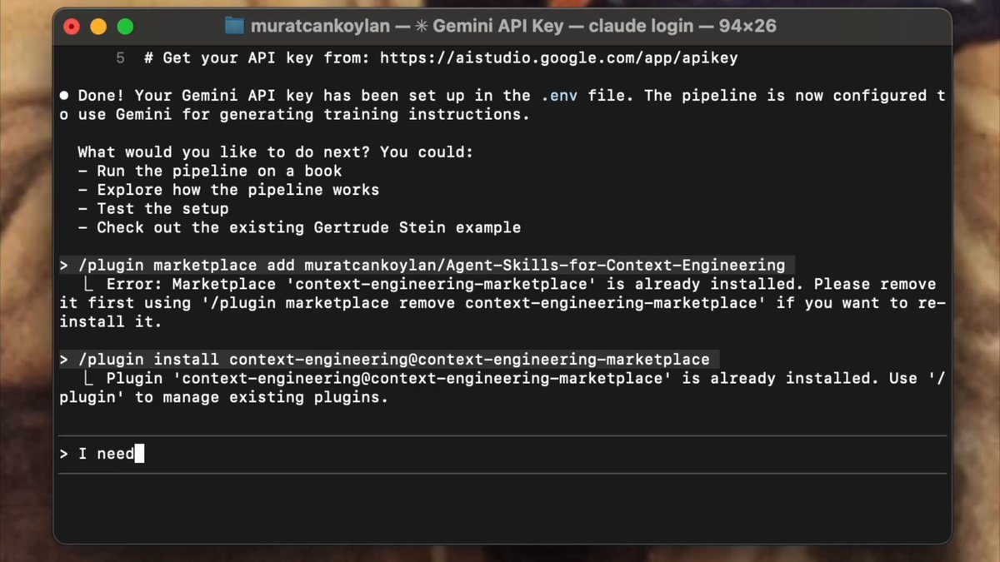
Quote
Muratcan Koylan
@koylanai
·
Dec 27, 2025
[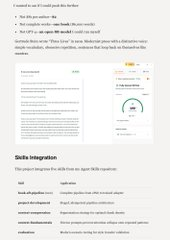](/koylanai/status/2004877190911950881/photo/1)
I wanted to try this, so I trained Qwen3-8B-Base on Gertrude Stein's "Three Lives" (1909) with Thinking Machines.
The model now writes in Stein's repetitive, rhythmic voice and gets Human Written label from AI Detection tools like Pangram.
https://muratcankoylan.com/projects/gertrude-stein-style-training/…
This became
Auto-Loading vs. Manual Invocation: Two types of skills solve two different problems. Reference skills (`voice-guide`, `writing-anti-patterns`) set `user-invocable: false` in their YAML frontmatter. The agent reads the description field and injects them automatically whenever the task involves writing. I never invoke them, they activate silently, every time. Task skills (`/write-blog`, `/topic-research`, `/content-workflow`) set `disable-model-invocation: true`. The agent can't trigger them on its own. I type the slash command, and the skill becomes the agent's complete instruction set for that task.
Muratcan Koylan
@koylanai
·
[Jan 29](/koylanai/status/2016684758588154239)
Progressive disclosure is not reliable because LLMs are inherently lazy.
"In 56% of eval cases, the skill was never invoked. The agent had access to the documentation but didn't use it."
Vercel ran evals on Next.js 16 APIs that aren't in model training data to test whether agents could learn framework-specific knowledge through Skills vs. persistent context.
Skills are the "correct" abstraction: package domain knowledge, let the agent invoke it when needed, minimal context. The agent decides when to retrieve.
They work well WHEN the user triggers them; otherwise, LLMs just ignore them.
Vercel's benchmarking is the first experiment of this kind I've seen, and it's actually interesting.
- Baseline (no docs): 53%
- Skill (default): 53%
- Skill with explicit instructions: 79%
- AGENTS[.]md with 8KB compressed docs index: 100%
The skill approach assumes agents reliably recognize when they need external knowledge and act on it. They don't.
"You MUST invoke the skill" made agents read docs first and miss project context. "Explore project first, then invoke" performed better. Same skill, different outcomes based on prompting.
The winning approach removed the decision entirely. An 8KB compressed index embedded in AGENTS[.]md, with one instruction: "Prefer retrieval-led reasoning over pre-training-led reasoning."
Two agent design learnings:
1. Passive context beats active retrieval for foundational knowledge. Don't make the agent decide to look things up, make the index always present.
2. Compress aggressively. Vercel went from 40KB to 8KB (80% reduction) with zero performance loss. The agent needs to know where to find docs, not have full content in context.
The gap between "agent can access X" and "agent will access X" is larger than we assume.
I keep seeing similar findings across agent architectures. Kimi Swarm's orchestrator is trained specifically to avoid sequential execution. Without training, orchestrators default to serial processing, planning a list of steps and executing them one by one. It's the EASY path.
The agent defaults to the lazy path: hallucinating from training data rather than retrieving docs. Passive context removes the choice entirely; the agent doesn't decide whether to look things up; the index is already there.
We keep finding that the "smarter", more autonomous design (let the agent decide when to X) underperforms the "dumber" design (always X, or structurally enforce X).
Quote
Vercel
@vercel
·
Jan 29
We're experimenting with ways to keep AI agents in sync with the exact framework versions in your projects. Skills, 𝙲𝙻𝙰𝚄𝙳𝙴.𝚖𝚍, and more.
But one approach scored 100% on our Next.js evals:
https://vercel.com/blog/agents-md-outperforms-skills-in-our-agent-evals…
Show more
Auto-loading solves the consistency problem. I don't have to remember to say "use my voice" every time I ask for a draft. The system remembers for me. Manual invocation solves the precision problem. A research task has different quality gates than a blog post. Keeping them separate prevents the agent from conflating two different workflows. The YAML frontmatter is the mechanism, and a few metadata fields control the entire loading behaviour.
[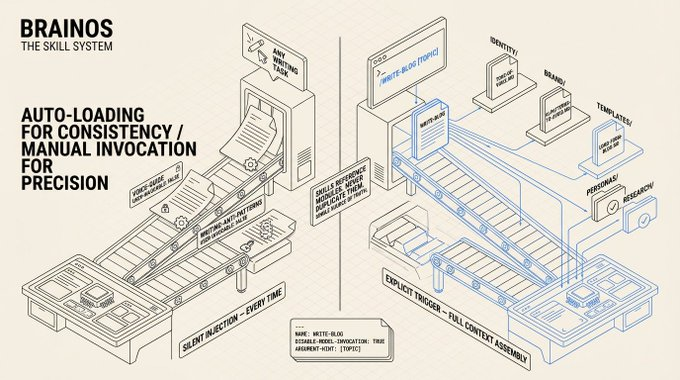](/koylanai/article/2025286163641118915/media/2025260062810238976)
When I type `/write-blog context engineering for marketing teams`, five things happen automatically: the voice guide loads (how I write), the anti-patterns load (what I never write), the blog template loads (7-section structure with word count targets), the persona folder is checked for audience profiles, and the research folder is checked for existing topic research. One slash command triggers a full context assembly. The skill file itself says "Read `brand/tone-of-voice.md`", it references the source module, never duplicates the content. Single source of truth.
Muratcan Koylan
@koylanai
·
[Jan 7](/koylanai/status/2008824728824451098)
I just built Ralph Wiggum Copywriter; learns your voice, critiques its own work, rewrites until it's actually good.
Self-critique loop hits different.
[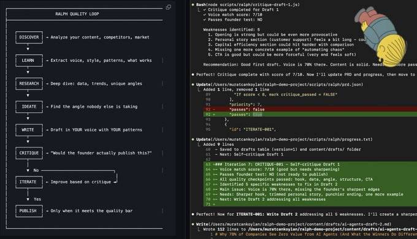](/koylanai/status/2008824728824451098/photo/1)
The Voice System: My voice is encoded as structured data and ngl with some vibes. The voice profile rates five attributes on a 1-10 scale: Formal/Casual (6), Serious/Playful (4), Technical/Simple (7), Reserved/Expressive (6), Humble/Confident (7). The anti-patterns file contains 50+ banned words across three tiers, banned openings, structural traps (forced rule of three, copula avoidance, excessive hedging), and a hard limit of one em-dash per paragraph.
[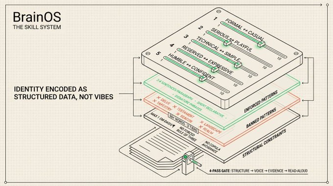](/koylanai/article/2025286163641118915/media/2025260657709400064)
Most people describe their voice with adjectives: "professional but approachable." That's useless for an AI. A 7 on the Technical/Simple scale tells the model exactly where to land. The banned word list is even more powerful; it's easier to define what you're NOT than what you are. The agent checks every draft against the anti-patterns list and rewrites anything that triggers it. The result is content that sounds like me because the guardrails prevent it from sounding like AI.
Every content template includes voice checkpoints every 500 words: "Am I leading with insight? Am I being specific with numbers? Would I actually post this?" The blog template has a 4-pass editing process built in: structure edit (does the hook grab?), voice edit (banned words scan, sentence rhythm check), evidence edit (claims sourced?), and a read-aloud test. The quality gates are part of the skill, not something I add after the fact.
Muratcan Koylan
@koylanai
·
[Oct 6, 2025](/koylanai/status/1975090268316827983)
How I built an AI agent system that automatically maintains my digital brain based on the content I engage with?
My personal context engineering architecture with Claude Sonnet 4.5, Groq Compound, Browser Use, all in Cursor 👇

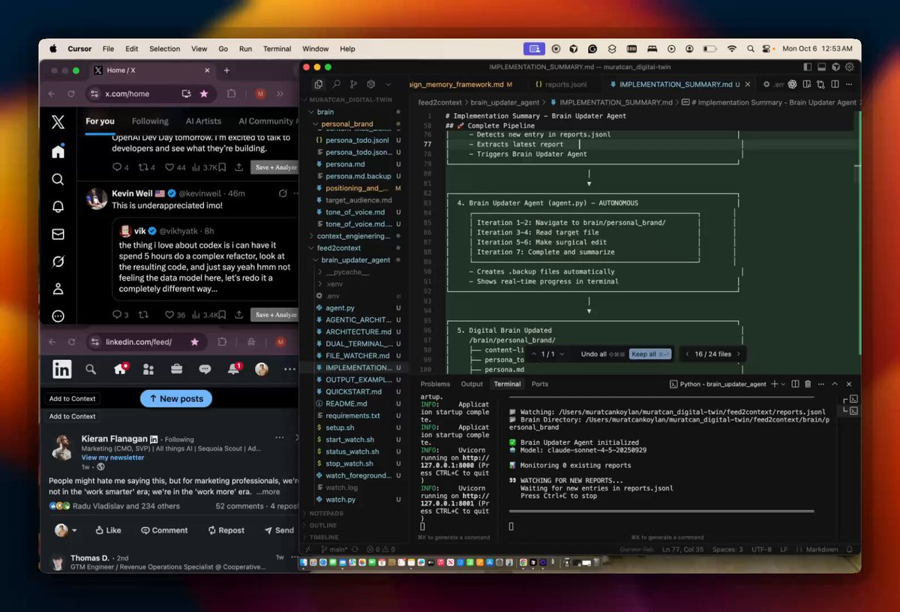
Templates as Structured Scaffolds: Five content templates define the structure for different content types. The long-form blog template has seven sections (Hook, Core Concept, Framework, Practical Application, Failure Modes, Getting Started, Closing) with word count targets per section totaling 2,000-3,500 words. The thread template defines an 11-post structure with a hook, deep-dive, results, and CTA. The research template has four phases: landscape mapping, technical deep-dive, evidence collection, and gap analysis.
Templates not only constrain creativity but also constrain chaos. Without structure, the agent produces amorphous blobs of text. With structure, it produces content that has rhythm, progression, and payoff. Each template also includes a quality checklist so the agent can self-evaluate before presenting the draft.
The research template outputs to `knowledge/research/[topic].md` with a structured format: Executive Summary, Landscape Map, Core Concepts, Evidence Bank (with statistics, quotes, case studies, and papers each cited with source and date), Failure Modes, Content Opportunities, and a Sources List graded HIGH/MEDIUM/LOW on reliability. That research document then feeds into the blog template's outline stage. The output of one skill becomes the input of the next. The pipeline builds on itself.
## 4) THE OPERATING SYSTEM: HOW I ACTUALLY USE THIS DAILY
Architecture is nothing without execution.
Here's how the system runs in practice.
The Content Pipeline: Seven stages: Idea, Research, Outline, Draft, Edit, Publish, Promote.
* Ideas are captured to `ideas.jsonl` with a scoring system, each idea rated 1-5 on alignment with positioning, unique insight, audience need, timeliness, and effort-versus-impact. Proceed if total score hits 15 or higher.
* Research outputs to the knowledge module.
* Drafts go through four editing passes.
* Published content gets logged to `posts.jsonl` with platform, URL, and engagement metrics.
* Promotion uses the thread template to create an X announcement and a LinkedIn adaptation.
[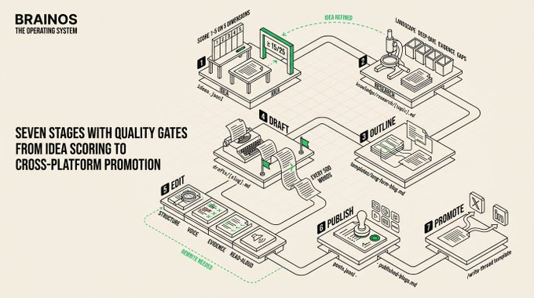](/koylanai/article/2025286163641118915/media/2025265634762731520)
I batch content creation on Sundays: 3-4 hours, target output of 3-4 posts drafted and outlined. The content calendar maps each day to a platform and content type.
The Personal CRM: Contacts organized into four circles with different maintenance cadences: inner (weekly), active (bi-weekly), network (monthly), dormant (quarterly reactivation). Each contact record has `can\_help\_with` and `you\_can\_help\_with` fields that enable the introduction matching system. cross-referencing these fields surfaces mutually valuable intros. Interactions are logged with sentiment tracking (positive, neutral, needs\_attention) so relationship health is visible at a glance.
[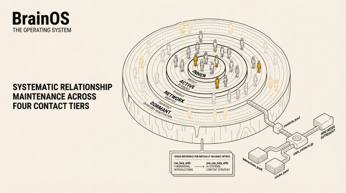](/koylanai/article/2025286163641118915/media/2025267841843249152)
Most people keep contacts in their head and let relationships decay through neglect. The `stale\_contacts` script cross-references contacts (who they are), interactions (when we last talked), and circles (how often we should talk) to surface outreach needs. A 30-second scan each week shows me which relationships need attention.
Specialized groups in `circles.yaml`founders, investors, ai\_builders, creators, mentors, mentees, each have explicit relationship development strategies. For AI builders: share useful content, collaborate on open source, provide tool feedback, amplify their work. For mentors: bring specific questions, update on progress from previous advice, look for ways to add value back. These are operational instructions the agent follows when I ask "Who should I reach out to this week?"
Automation Chains: Five scripts handle recurring workflows. They chain together for compound operations. The Sunday weekly review runs three scripts in sequence: `metrics\_snapshot.py` updates the numbers, `stale\_contacts.py` flags relationships, `weekly\_review.py` generates a summary document with completed-versus-planned, metrics trends, and next week's priorities. The content ideation chain reads recent bookmarks, checks undeveloped ideas, generates fresh suggestions, and cross-references with the content calendar to find scheduling gaps. These aren't cron jobs -- the agent runs them when I ask for a review, or I trigger them with `npm run weekly-review`.
Muratcan Koylan
@koylanai
·
[Feb 4](/koylanai/status/2018865011356053927)
This is how I consume X and LinkedIn.
Cursor is my cockpit. MCPs connect everything: Zapier for actions, alphaXiv for papers, Browser Use for scraping posts, ElevenLabs for audio. All managed through custom Skills in my Digital Brain OS repo.
Just saw an Anthropic announcement. Triggered my topic-research skill. The agent pulled sources from Apple newsroom and Anthropic docs, wrote a research report, generated a voice memo with my cloned voice, and sent it to my Slack.
Skills handle the workflows. MCPs handle the connections. I handle the decisions.

0:34
Scripts that output to stdout in agent-readable format close the loop between data and action. The weekly review script doesn't just tell me what happened -- it references my goals and identifies which key results are on track, which are behind, and what to prioritize next week. The scripts read from the same files the agent reads during normal operation, so there's no data duplication or synchronization problem.
[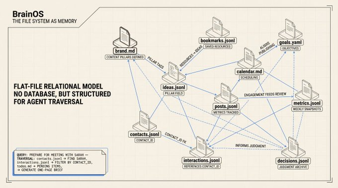](/koylanai/article/2025286163641118915/media/2025266035327197184)
After running the weekly review, the agent has everything it needs to update `
[todos.md](//todos.md)
` for next week, adjust `goals.yaml` progress numbers, and suggest content topics that align with underperforming key results. The review isn't a report -- it's the starting point for next week's planning. The automation creates a feedback loop: goals drive content, content drives metrics, metrics drive reviews, reviews drive goals.
## 5) WHAT I GOT WRONG AND WHAT I'D DO DIFFERENTLY
* I over-engineered the schema first pass. My initial JSONL schemas had 15+ fields per entry. Most were empty. Agents struggle with sparse data -- they try to fill in fields or comment on the absence. I cut schemas to 8-10 essential fields and added optional fields only when I actually had data for them. Simpler schemas, better agent behavior.
* The voice guide was too long at first. Version one of `
  [tone-of-voice.md](//tone-of-voice.md)
  ` was 1,200 lines. The agent would start strong, then drift by paragraph four as the voice instructions fell into the lost-in-middle zone. I restructured it to front-load the most distinctive patterns (signature phrases, banned words, opening patterns) in the first 100 lines, with extended examples further down. The critical rules need to be at the top, not the middle.
* Module boundaries matter more than you think. I initially had identity and brand in one module. The agent would load my entire bio when it only needed my banned words list. Splitting them into two modules cut token usage for voice-only tasks by 40%. Every module boundary is a loading decision. Get them wrong and you load too much or too little.
* Append-only is non-negotiable. I lost three months of post engagement data early on because an agent rewrote `posts.jsonl` instead of appending to it. JSONL's append-only pattern isn't just a convention -- it's a safety mechanism. The agent can add data. It cannot destroy data. This is the most important architectural decision in the system.
## 6) THE RESULTS AND THE PRINCIPLE BEHIND THEM
The real result is simpler than any metric. I open Cursor or Claude Code, start a conversation, and the AI already knows who I am, how I write, what I'm working on, and what I care about. It writes in my voice because my voice is encoded as structured data. It follows my priorities because my goals are in a YAML file it reads before suggesting what to work on. It manages my relationships because my contacts and interactions are in files it can query.
The principle behind all of it: this is context engineering, not prompt engineering. Prompt engineering asks "how do I phrase this question better?" Context engineering asks "what information does this AI need to make the right decision, and how do I structure that information so the model actually uses it?"
The shift is from optimizing individual interactions to designing information architecture. It's the difference between writing a good email and building a good filing system. One helps you once. The other helps you every time.
Muratcan Koylan
@koylanai
·
[Nov 9, 2025](/koylanai/status/1987254288393916571)
Kimi K2 is a great writer, but it's hard to explain your taste to LLMs.
So, I built an AI interviewer that extracts your literary DNA.
12-question interview → structured profile → reusable prompt.
Open sourcing shortly.
[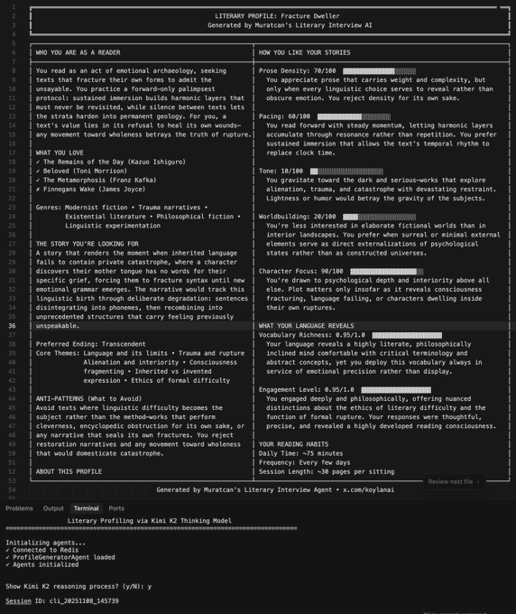](/koylanai/status/1987254288393916571/photo/1)
The entire system fits in a Git repository. Clone it to any machine, point any AI tool at it, and the operating system is running. Zero dependencies. Full portability. And because it's Git, every change is versioned, every decision is traceable, and nothing is ever truly lost.
Muratcan Koylan is Context Engineer at 
[Sully.ai](//Sully.ai)
, where he designs context engineering systems for healthcare AI. His on-source work on context engineering (8,000+ GitHub stars) is cited in academic research alongside Anthropic. Previously AI Agent Systems Manager at 99Ravens AI, building multi-agent systems handling 10,000+ weekly interactions.
Framework: [Agent Skills for Context Engineering](
<https://github.com/muratcankoylan/Agent-Skills-for-Context-Engineering>
)
Muratcan Koylan
@koylanai
·
[Dec 22, 2025](/koylanai/status/2002797649842331919)
I’m excited to share a new repo: Agent Skills for Context Engineering
Instead of just offering a library of black-box tools, it acts as a "Meta-Agent" knowledge base. It provides a standard set of skills, written in markdown and code, that you can feed to an agent so it
Show more
[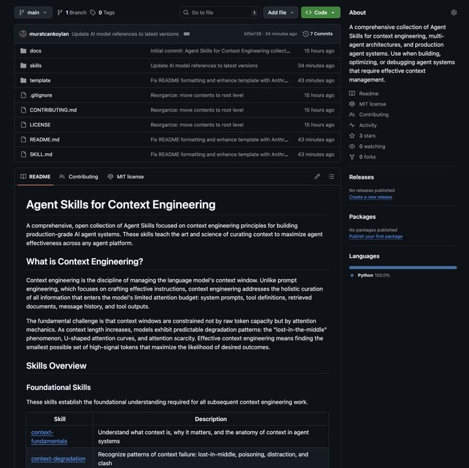](/koylanai/status/2002797649842331919/photo/1)
Quote
Muratcan Koylan
@koylanai
·
Dec 21, 2025
It’s actually a good question; the difference is subtle but structural.
I usually frame it like this:
AGENTS[.]md acts as the declarative context. You write this for every repo (and nested directories) to define the project structure, persona, and coding rules.
Skills are the x.com/AAAzzam/status…
Want to publish your own Article?
[Upgrade to Premium](/i/premium_sign_up)
---
### Discussion Thread
Context Engineering Skills 10x'd my project creation.
I rebuilt my digital brain system with Claude Code using the Context Plugin, so it is now a Personal OS.
It provides a complete folder-based architecture for managing:
- Personal Brand - Voice, positioning, values
- Content Creation - Ideas, drafts, publishing pipeline
- Knowledge Base - Bookmarks, research, learning
- Network - Contacts, relationships, introductions
- Operations - Goals, tasks, meetings, metrics
Because we're using Context Engineering principles in the Skills & Agent [.]md files, the system can be easily managed by small agents.
I'm adding the entire repo to GitHub tonight 🤫
AI Agent Personas should simulate the structure of human reasoning.
I’ve been arguing that you cannot "invent" a digital expert agent using just prompt engineering. You have to extract the expert via deep interviewing.
A new NeurIPS paper, "Simulating Society Requires
You should NOT use LLMs to generate synthetic human-like profiles.
I just read the NeurIPS paper "LLM Generated Persona is a Promise with a Catch" and it confirms a suspicion we’ve held for a long time: You cannot "invent" a realistic human being using just statistics and an LLM.
Yes, they are more scalable and cost-effective alternative to human interviews to create digital expert personas but this paper also proves that these synthetic profiles contain systematic biases that skew simulation results away from real-world outcomes.
The more creative freedom you give an LLM to generate a persona’s backstory, the further it drifts from reality.
Another important finding is that as LLM-generated content increases, simulated personas shift progressively toward left-leaning stances.
LLMs also systematically generate personas with overly optimistic outlooks, using positively valenced terms like "love," "proud," and "community" while omitting life challenges or negative experiences. This emotional bias is horrible for strategy and creativity-related decision-making tasks!
If you are building AI agents for strategy or decision-making, you don't want an idealized "Yes Man."
This is why I keep posting about the importance of Tacit Knowledge, Context Engineering, and AI Interviewer to extract human knowledge.
The research paper critiques the practice of "inventing" people from statistical margins (Census data + LLM imagination), whereas the system should focus on "extracting" people from ground truth (Real Expert + Interview).
After testing and evaluating LLM personas generated by public datasets, we observed that they are not ready for production AI agents.
That's why my focus is on building an interviewer experience that extracts as much learning as possible from the human expert, and creating a context system that grounds that expert's outputs in truth; using a real-time, long-form interview to capture "implicit knowledge" and "distinctive methodologies".
Another architectural difference that I find is relying heavily on single-pass prompting. They feed demographic data into an LLM and ask it to generate a "Descriptive Persona" (a narrative bio). They found this introduces massive bias.
To address these critical flaws in the current persona generation, I propose the following to resolve or at least mitigate these specific issues:
1. Addressing the "Joint Distribution" Issue:
Researchers report that they cannot precisely simulate an individual due to fragmented datasets (e.g., they have data on "Income" and "Education" separately but lack information on their overlap for a specific person), resulting in "incongruous combinations."
By interviewing a real human, you capture the natural joint distribution of their beliefs. You don't have to guess if a "high-income expert" cares about "sustainability"; the expert tells you. We need to bypass the statistical reconstruction problem entirely by building scalable interviewer solutions.
2. Avoiding "Positivity Bias" & "Leftward Drift": The paper proves that when LLMs are asked to write a persona description (Descriptive Persona), they default to "pollyannaish," overly positive, and politically progressive profiles.
The interviewer system should be designed to gather insights into "mistakes," "judgment," and "distinctive methodologies" rather than generic best practices. By forcing the model to ingest a transcript of hard-won lessons and failures, you will override the model's default tendency to be "nice" and "generic."
The paper also mentions a lack of "ground truth" to validate if a persona is accurate. My solution includes a built-in validation loop where the human expert reviews and scores the output. This "Human-in-the-Loop" verification is exactly what the researchers argue is missing from the field.
"Descriptive Personas" generated by LLMs are articulate but statistically flawed. To scale true expertise, we must stop trying to simulate people and start interviewing them.
Most people treat AI like Google: ask a question, get an answer. But what if AI could think \*like/with you?\*
I reverse-engineer "Theory of Mind" to test if the model can form a "theory of my mind".
Using AI as a mirror to understand myself by giving it personal context and
The problem is how memory gets into the context window and what happens when compaction wipes it.
OpenClaw loads MEMORY[.]md plus the last two days of daily logs at session start. Static injection. Everything gets stuffed into the context window upfront. When the window fills up, compaction fires and summarizes your loaded memories away. The agent silently writes durable memories to disk before compaction hits. But after the window resets, the agent can't systematically browse what it flushed. It runs search queries and hopes the right chunks surface. The memory exists on disk. The agent just lost the ability to walk through it.
This is a context delivery problem.
Everything is a file. Mount memory, tools, knowledge, and human input into a single namespace. Give the agent list, read, write, and search operations. Let it pull what's relevant per turn instead of dumping everything at boot.
Cursor validated this in production with their "dynamic context discovery" approach, which stores tool responses, chat history, MCP tools, and terminal sessions as files that the agent reads on demand. When compaction fires in Cursor, the agent still has the full chat history as a file. It reads back what it needs instead of losing it to summarization.
Markdown memory files exist in OpenClaw. SQLite-backed hybrid search exists. memory\_search and memory\_get tooling exists. What's missing is the abstraction layer that turns static file loading into dynamic file system access.
Here's what that actually means in practice.
All agent context goes under one predictable namespace. Immutable interaction logs at /context/history/ are the source-of-truth timeline, spanning agents and sessions. Episodic memory at /context/memory/episodic/ holds session-bounded summaries. Fact memory at /context/memory/fact/ stores atomic durable entries like preferences, decisions, and constraints that rarely change. User memory at /context/memory/user/ tracks personal attributes. Task-scoped scratchpads at /context/pad/ are temporary working notes that can be promoted to durable memory or discarded. Tool metadata lives at /context/tools/. Session artifacts at /context/sessions/.
This three-tier split (scratchpad, episodic, fact) replaces OpenClaw's current binary between "today's log" and "forever file." MEMORY[.]md conflates atomic facts like "user prefers dark mode" with episodic context like what happened in last week's project. Daily logs conflate scratchpad work with session notes. Separating them gives each tier its own retention policy and promotion path.
The agent gets explicit file operations at runtime. It can discover what context is available before loading anything. It can pull only the exact slice needed. It can grep by keywords, semantics, or both. It can persist new memory with retention rules and promote validated context from temporary to durable storage. Memory stops being a preload and becomes something the agent discovers, fetches, and evolves per turn.
Between the filesystem and the token window, you need an operational layer. Before each reasoning turn, a constructor selects and compresses context from the filesystem into a token-budget-aware input.
It queries recency and relevance metadata, applies summarization, and produces a manifest recording what was selected, what was excluded, and why.
When memory fails silently, there's no way to ask "what did the agent load and what did it skip?" During extended sessions, an updater incrementally streams additional context as reasoning unfolds, replacing outdated pieces based on model feedback instead of stuffing everything upfront.
After each response, an evaluator checks outputs against source context, writes verified information back to the filesystem as structured memory, and flags human review when confidence is low.
Here's why this changes memory behavior.
Compaction stops being destructive. After the window resets, the agent can still list and read context files directly. Search-based retrieval still works, but now it's paired with structured browsing.
Token usage becomes demand-driven. The agent loads only what the active task requires.
Memory gets a real lifecycle. Scratchpad notes graduate to episodic summaries. Episodic summaries harden into durable facts. Each transition is a logged, versioned event with timestamps and lineage. No more binary split between "today's log" and "forever file."
Human review becomes native. Not just "you can open the Markdown file and check." Every mutation is a traceable event. Humans can diff memory evolution, audit what was promoted and why, and inject corrections that the agent discovers alongside its own memories.
Context assembly becomes debuggable. The manifest records what the constructor selected for each turn. When the agent gets something wrong, you can trace whether it had the right context, loaded the wrong slice, or never found the relevant file.
If you're hitting the same problem, here's the upgrade path that doesn't break existing workflows.
Start by returning file references before snippets and emitting manifests that log what was loaded per turn.
Then expose context sources under /context/\* paths and enable list and read at runtime so the agent can browse what's available without loading everything.
After that, shift boot-time injection to minimal preload plus on-demand fetch and decompose MEMORY[.]md into fact and episodic stores with separate retrieval.
The final step adds promotion, archival, retention policies, and audit logs so every state transition is versioned and reversible.
Your system needs to let the agent access context on demand instead of blindly inheriting it at startup.
OpenAI wants markdown structure. Anthropic prefers XML tags. Google emphasizes few-shot examples.
So I built a simple agent system that reads the official prompting docs and applies them to the given prompt.
Each optimizer runs a ReAct loop:
- list\_provider\_docs → discover
Your best people can't document their expertise because they don't know what they know until they're asked.
We built an interviewer that achieves peer status, so experts reveal the judgment patterns they'd only share with a colleague.
I wrote a blog about how we architected the multi-agent system behind this, how we extract expert thinking, and build digital personas that feel like talking to a peer.
[https://99ravens.agency/resources/blogs/your-experts-wont-train-your-ai-you-have-to-interview-them/…](https://t.co/83D7EBu9rw)
Most "agentic" failures happen because the model lacks specific domain knowledge.
Here I'm showing how loading a Skills Plugin solves that for dataset generation. I turned a research paper (shows fine-tuning dataset creation from books) into a Skill and just gave a book link
Progressive disclosure is not reliable because LLMs are inherently lazy.
"In 56% of eval cases, the skill was never invoked. The agent had access to the documentation but didn't use it."
Vercel ran evals on Next.js 16 APIs that aren't in model training data to test whether agents could learn framework-specific knowledge through Skills vs. persistent context.
Skills are the "correct" abstraction: package domain knowledge, let the agent invoke it when needed, minimal context. The agent decides when to retrieve.
They work well WHEN the user triggers them; otherwise, LLMs just ignore them.
Vercel's benchmarking is the first experiment of this kind I've seen, and it's actually interesting.
- Baseline (no docs): 53%
- Skill (default): 53%
- Skill with explicit instructions: 79%
- AGENTS[.]md with 8KB compressed docs index: 100%
The skill approach assumes agents reliably recognize when they need external knowledge and act on it. They don't.
"You MUST invoke the skill" made agents read docs first and miss project context. "Explore project first, then invoke" performed better. Same skill, different outcomes based on prompting.
The winning approach removed the decision entirely. An 8KB compressed index embedded in AGENTS[.]md, with one instruction: "Prefer retrieval-led reasoning over pre-training-led reasoning."
Two agent design learnings:
1. Passive context beats active retrieval for foundational knowledge. Don't make the agent decide to look things up, make the index always present.
2. Compress aggressively. Vercel went from 40KB to 8KB (80% reduction) with zero performance loss. The agent needs to know where to find docs, not have full content in context.
The gap between "agent can access X" and "agent will access X" is larger than we assume.
I keep seeing similar findings across agent architectures. Kimi Swarm's orchestrator is trained specifically to avoid sequential execution. Without training, orchestrators default to serial processing, planning a list of steps and executing them one by one. It's the EASY path.
The agent defaults to the lazy path: hallucinating from training data rather than retrieving docs. Passive context removes the choice entirely; the agent doesn't decide whether to look things up; the index is already there.
We keep finding that the "smarter", more autonomous design (let the agent decide when to X) underperforms the "dumber" design (always X, or structurally enforce X).
I just built Ralph Wiggum Copywriter; learns your voice, critiques its own work, rewrites until it's actually good.
Self-critique loop hits different.
How I built an AI agent system that automatically maintains my digital brain based on the content I engage with?
My personal context engineering architecture with Claude Sonnet 4.5, Groq Compound, Browser Use, all in Cursor 👇
This is how I consume X and LinkedIn.
Cursor is my cockpit. MCPs connect everything: Zapier for actions, alphaXiv for papers, Browser Use for scraping posts, ElevenLabs for audio. All managed through custom Skills in my Digital Brain OS repo.
Just saw an Anthropic announcement. Triggered my topic-research skill. The agent pulled sources from Apple newsroom and Anthropic docs, wrote a research report, generated a voice memo with my cloned voice, and sent it to my Slack.
Skills handle the workflows. MCPs handle the connections. I handle the decisions.
Kimi K2 is a great writer, but it's hard to explain your taste to LLMs.
So, I built an AI interviewer that extracts your literary DNA.
12-question interview → structured profile → reusable prompt.
Open sourcing shortly.
I’m excited to share a new repo: Agent Skills for Context Engineering
Instead of just offering a library of black-box tools, it acts as a "Meta-Agent" knowledge base. It provides a standard set of skills, written in markdown and code, that you can feed to an agent so it